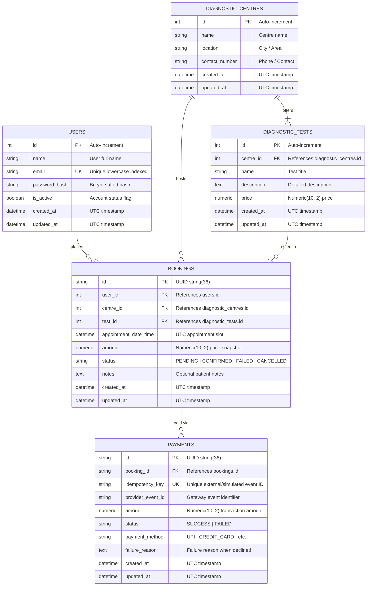

# MedSlot — Diagnostic Test Booking & Payment Service

[](https://github.com/Vikasks13/MedSlot)
[](https://python.org)
[](https://fastapi.tiangolo.com)
[](https://www.postgresql.org)
[](https://www.docker.com)
[](tests)

A robust, production-grade backend service built for **EVE Healthcare** to manage diagnostic centres, test bookings, and simulated payments with idempotent webhook handling.

---

## 🚀 Repository & Project Details

- **GitHub Repository**: [https://github.com/Vikasks13/MedSlot](https://github.com/Vikasks13/MedSlot)
- **Framework**: FastAPI (Async Python 3.12)
- **Database**: PostgreSQL 16 (production/Docker) & SQLite with `aiosqlite` (local fallback)
- **ORM / Migrations**: SQLAlchemy 2.0 (Async) + Alembic
- **Authentication**: JWT (JSON Web Tokens) with `HS256` & `passlib[bcrypt]`
- **Testing**: `pytest`, `pytest-asyncio`, `httpx`

---

## 📁 Project Architecture & Structure

```
eve_healthcare/
├── app/
│   ├── main.py                  # FastAPI application entrypoint & lifespan
│   ├── config.py                # Environment configuration (pydantic-settings)
│   ├── database.py              # Async SQLAlchemy engine, session maker, get_db dependency
│   ├── dependencies.py          # Auth & user dependencies (Phase 1)
│   ├── models/                  # SQLAlchemy ORM models
│   │   └── __init__.py
│   ├── schemas/                 # Pydantic validation & serialization schemas
│   │   └── __init__.py
│   ├── routers/                 # API endpoint routers
│   │   └── __init__.py
│   ├── services/                # Business logic services
│   │   └── __init__.py
│   └── utils/                   # Utilities, security helpers, idempotency guards
│       └── __init__.py
├── alembic/                     # Database migrations
│   ├── env.py                   # Async Alembic runner
│   ├── script.py.mako           # Migration template
│   └── versions/                # Generated revision files
├── tests/                       # Unit & integration test suite
│   ├── conftest.py              # Fixtures (in-memory async DB, AsyncClient)
│   └── test_health.py           # Health check & system tests
├── .env.example                 # Template environment variables
├── .env                         # Local environment configuration
├── .gitignore                   # Git ignore rules
├── Dockerfile                   # Production container definition
├── docker-compose.yml           # Multi-container orchestration (API + Postgres + Redis)
├── pytest.ini                   # Pytest configuration
├── requirements.txt             # Dependency manifest
└── README.md                    # Project documentation
```

---

## 🛠️ Quick Start & Local Setup

### Option 1: Running with Docker Compose (Recommended)

To run the entire stack including PostgreSQL and Redis:

```bash
# 1. Clone repository
git clone https://github.com/Vikasks13/MedSlot.git
cd MedSlot

# 2. Build and start services
docker-compose up --build -d

# 3. View live logs
docker-compose logs -f api
```

The service will be live at:
- **API Base**: `http://localhost:8000`
- **Interactive Swagger Docs**: `http://localhost:8000/docs`
- **ReDoc Documentation**: `http://localhost:8000/redoc`
- **Health Check**: `http://localhost:8000/health`

---

### Option 2: Running Locally with Python Virtual Environment

```bash
# 1. Create and activate a Python 3.12 virtual environment
python -m venv .venv

# On Windows (PowerShell):
.venv\Scripts\Activate.ps1
# On macOS/Linux:
source .venv/bin/activate

# 2. Install dependencies
pip install -r requirements.txt

# 3. Copy environment configuration
cp .env.example .env

# 4. Start the development server
uvicorn app.main:app --reload --host 0.0.0.0 --port 8000
```

---

## 🧪 Running Tests

MedSlot uses `pytest` and `httpx.AsyncClient` with an isolated in-memory SQLite database for high-speed, repeatable tests:

```bash
# Run all tests
pytest

# Run tests with verbose output
pytest -v
```

---

## 🔐 API Reference — Authentication (Phase 1)

| Method | Endpoint | Auth Required | Description |
|:---|:---|:---|:---|
| `POST` | `/api/v1/auth/signup` | No | Register new user with name, unique email, and password |
| `POST` | `/api/v1/auth/login` | No | JSON login returning JWT Bearer access token |
| `POST` | `/api/v1/auth/login/token` | No | Form-encoded login for Swagger UI Authorize modal |
| `GET` | `/api/v1/auth/me` | Bearer Token | Retrieve currently authenticated user profile |

### Example Signup Request
```bash
curl -X POST http://localhost:8000/api/v1/auth/signup \
  -H "Content-Type: application/json" \
  -d '{"name": "Alice Johnson", "email": "alice@example.com", "password": "securepassword123"}'
```

### Example Login Request
```bash
curl -X POST http://localhost:8000/api/v1/auth/login \
  -H "Content-Type: application/json" \
  -d '{"email": "alice@example.com", "password": "securepassword123"}'
```

---

## 🏥 API Reference — Diagnostic Centres & Tests (Phase 2)

| Method | Endpoint | Auth Required | Description |
|:---|:---|:---|:---|
| `GET` | `/api/v1/centres` | No | List paginated centres with tests, with optional `location` & `search` filters |
| `POST` | `/api/v1/centres` | Bearer Token | Create a new diagnostic centre |
| `GET` | `/api/v1/centres/{id}` | No | Get centre details by ID including all offered tests |
| `GET` | `/api/v1/centres/{id}/tests` | No | List tests offered by a specific diagnostic centre |
| `POST` | `/api/v1/centres/{id}/tests` | Bearer Token | Add a diagnostic test with name, description, and price to a centre |
| `GET` | `/api/v1/tests/{test_id}` | No | Get specific diagnostic test details |

### Example Create Diagnostic Centre Request
```bash
curl -X POST http://localhost:8000/api/v1/centres \
  -H "Authorization: Bearer <TOKEN>" \
  -H "Content-Type: application/json" \
  -d '{"name": "Apollo Diagnostics", "location": "Koramangala, Bangalore", "contact_number": "+91-9876543210"}'
```

### Example Add Test to Centre Request
```bash
curl -X POST http://localhost:8000/api/v1/centres/1/tests \
  -H "Authorization: Bearer <TOKEN>" \
  -H "Content-Type: application/json" \
  -d '{"name": "Complete Blood Count (CBC)", "description": "Full blood panel", "price": 450.00}'
```

---

## 📅 API Reference — Booking System (Phase 3)

| Method | Endpoint | Auth Required | Description |
|:---|:---|:---|:---|
| `POST` | `/api/v1/bookings` | Bearer Token | Book a diagnostic test (starts in `PENDING` state) |
| `GET` | `/api/v1/bookings` | Bearer Token | List current user's bookings with pagination and status filter |
| `GET` | `/api/v1/bookings/{id}` | Bearer Token | Retrieve single booking details (ownership enforced) |
| `PATCH` | `/api/v1/bookings/{id}/cancel` | Bearer Token | Cancel a `PENDING` or `CONFIRMED` booking (status -> `CANCELLED`) |

### Booking Status Lifecycle
```
 [Create Booking] ──► PENDING ────(Payment Success)──► CONFIRMED ──► [Completed]
                         │                                 │
                         │ (Payment Failed)                │ (User Cancels)
                         ▼                                 ▼
                       FAILED                          CANCELLED
```

### Example Create Booking Request
```bash
curl -X POST http://localhost:8000/api/v1/bookings \
  -H "Authorization: Bearer <TOKEN>" \
  -H "Content-Type: application/json" \
  -d '{
    "centre_id": 1,
    "test_id": 1,
    "appointment_date_time": "2026-10-01T10:00:00Z",
    "notes": "Patient requires wheelchair assistance"
  }'
```

### Example Cancel Booking Request
```bash
curl -X PATCH http://localhost:8000/api/v1/bookings/<BOOKING_UUID>/cancel \
  -H "Authorization: Bearer <TOKEN>"
```

---

## 💳 API Reference — Simulated Payments & Webhook (Phase 4)

| Method | Endpoint | Auth Required | Description |
|:---|:---|:---|:---|
| `POST` | `/payments` or `/api/v1/payments` | Bearer Token | Process simulated payment for a booking (transitions to `CONFIRMED` or `FAILED`) |
| `POST` | `/payments/webhook` or `/api/v1/payments/webhook` | Optional Secret Header | Idempotent webhook accepting external/simulated provider status events |
| `GET` | `/payments/{id}` or `/api/v1/payments/{id}` | Bearer Token | Retrieve single payment record by ID (ownership verified) |

### 🔒 Idempotency Guarantee
The webhook endpoint is protected by a two-layer idempotency defense:
1. **Application-Level Check**: Look up `idempotency_key == event_id`. If already processed, immediately return `200 OK` with `status: "already_processed"` without creating duplicate payments or corrupting booking state.
2. **Database-Level Unique Constraint**: A `UNIQUE` constraint and index on `payments.idempotency_key` ensures that even under concurrent race conditions from distributed workers, only one transaction can commit.

### Example Simulated Payment Request
```bash
curl -X POST http://localhost:8000/payments \
  -H "Authorization: Bearer <TOKEN>" \
  -H "Content-Type: application/json" \
  -d '{
    "booking_id": "<BOOKING_UUID>",
    "payment_method": "UPI",
    "simulate_status": "SUCCESS"
  }'
```

### Example Payment Webhook Request
```bash
curl -X POST http://localhost:8000/payments/webhook \
  -H "Content-Type: application/json" \
  -d '{
    "event_id": "evt_gateway_unique_987654",
    "event_type": "payment.succeeded",
    "booking_id": "<BOOKING_UUID>",
    "amount": 600.00,
    "status": "SUCCESS",
    "payment_method": "RAZORPAY_SIMULATED"
  }'
```

---

## 🛡️ Edge Cases, Hardening & Observability (Phase 5)

### 1. Standardized Error Formats
All errors return a consistent, structured JSON envelope across the entire API:
```json
{
  "status_code": 422,
  "detail": [
    {
      "field": "body -> price",
      "message": "Input should be greater than 0",
      "type": "greater_than"
    }
  ],
  "error_type": "ValidationError",
  "path": "/api/v1/centres/1/tests"
}
```
Internal server errors (500) are intercepted to prevent sensitive stack traces or environment variables from leaking to consumers.

### 2. Structured Request Logging & Observability
- **JSON Request Logging**: Intercepts every inbound request and emits structured log entries containing HTTP method, path, status code, client IP, and execution latency.
- **Latency Header**: Emits an `X-Process-Time-Ms` response header on all outgoing responses for APM monitoring and distributed tracing.

### 3. Sliding Window Rate Limiting
In-memory sliding-window rate limiting protects sensitive endpoints against abuse and brute-force attacks:
- **Authentication Endpoints** (`/api/v1/auth/login`, `/api/v1/auth/login/token`): Max 10 requests / 60 seconds per IP.
- **Payment Webhook** (`/payments/webhook`): Max 60 requests / 60 seconds per IP.
- Exceeding the threshold immediately yields `HTTP 429 Too Many Requests` with a dynamic `Retry-After` header indicating seconds until requests can resume.

### 4. Edge Cases Defended
- **Ownership Isolation**: Users cannot view, modify, or pay for bookings owned by other users (`403 Forbidden`).
- **Test-Centre Relationship Mismatch**: Booking a test at a centre that does not offer that test is rejected (`400 Bad Request`).
- **Past Appointment Dates**: Appointments scheduled in the past are rejected during request validation (`422 Unprocessable Content`).
- **State Machine Integrity**: Completed or Cancelled bookings cannot be paid or transitioned illegally (`400 Bad Request`).
- **Negative & Zero Prices**: Tests must have a price > 0.00 (`422 Unprocessable Content`).
---

## 🧪 Comprehensive Test Suite & 97% Coverage (Phase 6)

MedSlot features a battle-tested test suite with **49 tests** spanning unit, integration, error-handling, concurrency, and idempotency tests:

```bash
# Run full test suite with coverage report
pytest --cov=app --cov-report=term-missing
```

### Coverage Highlights

| Component | Coverage | Highlights Covered |
|:---|:---:|:---|
| **`app/services/*`** | **100%** | All 4 services (`Auth`, `Booking`, `Centre`, `Payment`) fully covered |
| **`app/routers/*`** | **100%** | All endpoints, request/response models, query aliases & headers |
| **`app/models/*`** | **100%** | Full model schemas, relationships, constraints & `__repr__` |
| **`app/schemas/*`** | **100%** | Pydantic validators, future datetime checks, numeric price bounds |
| **`app/dependencies.py`**| **100%** | Valid JWT, missing `sub`, corrupt payload, inactive user checks |
| **`app/utils/security.py`**| **100%** | Bcrypt hashing, verification, JWT encode/decode, extra claims |
| **`app/utils/exceptions.py`**| **100%** | Standardized 404, 422 validation locators, catch-all 500 |
| **`app/utils/rate_limit.py`**| **94%** | Sliding-window limiter, 429 status code, `Retry-After` header |
| **`app/utils/cache.py`** | **87%** | In-memory fallback, TTL expiration, pattern deletion, mocked Redis |
| **OVERALL PROJECT** | **97%** | **49 passed, 0 failures, 0 warnings** |

---

## 🗄️ Database & Schema Design

MedSlot uses a relational schema designed with PostgreSQL in mind, featuring strict referential integrity, composite & unique indexes, and numeric precision for financial auditing:



### Key Architectural Schema Decisions

1. **UUID Primary Keys for Bookings & Payments**:
   - `bookings.id` and `payments.id` use `String(36)` containing RFC-4122 standard UUIDs.
   - Prevents **ID enumeration attacks** where malicious users crawl sequential integer IDs (`/bookings/1`, `/bookings/2`).
2. **Decimal Snapshotting (`Numeric(10, 2)`)**:
   - Diagnostic test prices can change over time. When a booking is created, the current price is captured in `bookings.amount`.
   - Subsequent changes to test pricing do not alter historical booking totals.
   - Python `Decimal` is used across all layers to avoid IEEE 754 floating-point rounding errors.
3. **Database-Level Idempotency (`payments.idempotency_key UNIQUE`)**:
   - Webhook events store `event_id` in `idempotency_key` with a `UNIQUE` constraint and index.
   - Guaranteed against duplicate records and state corruption even under distributed concurrent deliveries.
4. **Foreign Key Indexes**:
   - All foreign keys (`user_id`, `centre_id`, `test_id`, `booking_id`) are indexed to optimize relational joins and queries.

---

## 💡 Important Assumptions Made

1. **Dual Payment Modalities**:
   - **Simulated Payment (`POST /payments`)**: Allows the authenticated patient to simulate a checkout payment directly from their client app.
   - **Payment Webhook (`POST /payments/webhook`)**: Allows payment gateways (e.g., Razorpay, Stripe) to asynchronously notify the platform of transaction results.
2. **Booking & Test Compatibility**:
   - When creating a booking, the system verifies that the selected `test_id` actually belongs to the specified `centre_id`. Mismatched combinations are rejected with `400 Bad Request`.
3. **State Transition Immutability**:
   - A `CANCELLED` booking cannot be revived or paid for.
   - A `CONFIRMED` booking cannot be paid again.
   - A `FAILED` booking cannot be cancelled (it never confirmed).
4. **Ownership Access Control**:
   - Patients can only view and manage their own bookings and payment records. Accessing another user's resource yields `403 Forbidden`.
5. **Future Appointments Only**:
   - Appointment timestamps must be in the future relative to the booking creation time (validated via Pydantic validator).
6. **Graceful Fallbacks for Infrastructure**:
   - If Redis is unavailable, the application falls back seamlessly to an in-memory dictionary cache with TTL eviction without interrupting API traffic.
   - If PostgreSQL is not configured, the application falls back to async SQLite (`aiosqlite`) for frictionless local developer onboarding.

---

## 🚀 What I Would Improve With More Time

1. **Real Payment Gateway Integration**:
   - Implement production-grade webhook HMAC-SHA256 signature verification for providers like Razorpay or Stripe.
2. **Asynchronous Background Worker**:
   - Introduce **Celery** or **ARQ** with Redis as a broker to offload email/SMS appointment confirmations, invoice PDF generation, and webhook retries out-of-band.
3. **Distributed Slot Locking (Prevent Overbooking)**:
   - Implement Redis distributed locks (`Redlock`) or PostgreSQL row-level locks (`SELECT FOR UPDATE`) on centre time slots to prevent multiple users from booking the exact same time slot concurrently.
4. **Role-Based Access Control (RBAC)**:
   - Add granular permission scopes (`admin`, `staff`, `patient`) allowing centre staff to update test availability, reschedule appointments, and view lab reports.
5. **Full-Text Search Engine**:
   - Implement PostgreSQL `tsvector` / trigram indexes or integrate Elasticsearch for fuzzy search on centres and test catalogs.
6. **Token Revocation & Refresh Token Rotation**:
   - Implement refresh tokens with sliding expiration and a Redis-backed token blacklist for instantaneous user logout and session revocation.
7. **Production Telemetry & Tracing**:
   - Export structured logs and metrics to OpenTelemetry collector, Prometheus, and Grafana.

---

## 📌 Implementation Phases & Status

- [x] **Phase 0 — Project Bootstrap**: Structure, FastAPI setup, config, Docker, Alembic, health check, pytest suite.
- [x] **Phase 1 — Authentication**: User signup, login, password hashing, JWT creation & verification, OAuth2 Swagger support.
- [x] **Phase 2 — Diagnostic Centres & Tests**: Centre & test management, nested retrieval, pagination, caching.
- [x] **Phase 3 — Booking System**: Test bookings, ownership validation, status FSM.
- [x] **Phase 4 — Payments & Idempotent Webhook**: Simulated payment provider and webhook idempotency.
- [x] **Phase 5 — Edge Cases & Hardening**: Ownership checks, standardized error formatting, structured logging, sliding-window rate limiting.
- [x] **Phase 6 — Comprehensive Test Suite**: 49 tests, 97% code coverage, 100% router/service coverage.
- [x] **Phase 7 — Final Documentation & Polish**: Complete OpenAPI specs, schema diagrams, design assumptions, and GitHub submission readiness.


